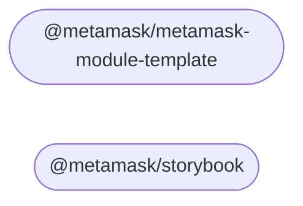

# MetaMask Design System

The MetaMask Design System monorepo

## Modules

This repository contains the following packages [^fn1]:

<!-- start package list -->

- [`@metamask/metamask-module-template`](packages/metamask-module-template)
- [`@metamask/storybook`](packages/storybook)

<!-- end package list -->

Or, in graph form [^fn1]:

<!-- start dependency graph -->

<!-- end dependency graph -->

Refer to individual packages for usage instructions.

## Learn more

For instructions on performing common development-related tasks, see [contributing to the monorepo](./docs/contributing.md).

[^fn1]: The package list and dependency graph should be programmatically generated by running `yarn update-readme-content`.
