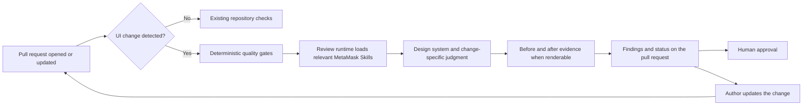
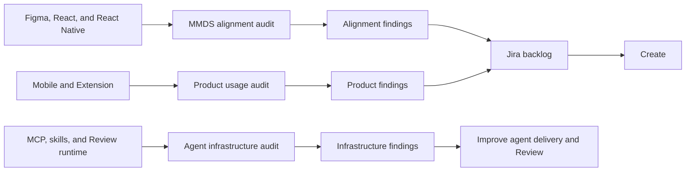
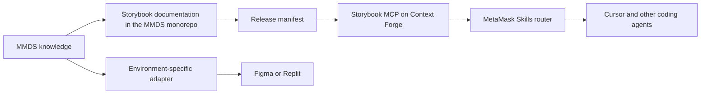
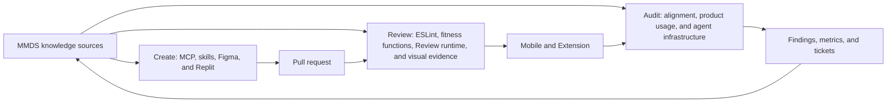

# MetaMask agentic design system strategy

**Status:** Draft

**Owner:** MetaMask Design System team

**Last updated:** 2026-08-27

## 1. Goal

Any agent building MetaMask UI should use the MetaMask Design System (MMDS) by default. We should be able to check its work automatically against our tokens, components, and patterns. A design system designer or engineer should only need to review work that requires human judgment.

This applies anywhere UI gets built: Cursor and other coding agents, Figma, Replit prototypes, and CI.

The primary audience is the MetaMask Design System team. The strategy also directs implementation with partner teams, especially AI Platform Engineering and contributors in the `ai-platform-eng` channel. MMDS owns the design system knowledge and quality standard. Partner teams help provide the shared agent, Review, and infrastructure capabilities needed to apply it.

### Success measures

Success means agents can build and check MetaMask UI using current MMDS knowledge. Humans should focus on exceptions and decisions that require judgment.

Foundation work will establish a baseline for each quality measure. We will set targets after the first Mobile and Extension pilots.

| Success criterion                      | How we measure it                                                                                                                                                           | Initial target                                                                 |
| :------------------------------------- | :-------------------------------------------------------------------------------------------------------------------------------------------------------------------------- | :----------------------------------------------------------------------------- |
| **First drafts use MMDS correctly**    | Pass rate across representative UI tasks and the share of drafts needing design system rework                                                                               | Establish a pilot baseline, then improve it each quarter                       |
| **Automated review covers UI changes** | Percentage of UI pull requests that complete deterministic and agentic checks                                                                                               | 100% in participating Mobile and Extension repositories                        |
| **Review feedback is useful**          | Accepted findings, dismissed findings, false-positive rate, and human escalations                                                                                           | Establish a baseline before setting a quality target                           |
| **Off-system UI is visible**           | Percentage of audited UI classified as MMDS, intentional custom UI, unintended custom UI, or unknown                                                                        | Classify 100% of audited pilot surfaces and reduce unknown results toward zero |
| **Guidance remains current**           | Time between an MMDS release and its guidance becoming available to agents                                                                                                  | Available in the same release, with no manual component lists                  |
| **MMDS maintains three-way alignment** | Percentage of shared components aligned across Figma, React, and React Native for naming, variants, states, behavior, tokens, and documentation; plus Code Connect coverage | 100% aligned or covered by a documented, intentional platform exception        |
| **Product drift falls over time**      | New design system findings in recurring audits                                                                                                                              | A downward trend after Review checks are enabled                               |

Two things are worth stating plainly before the detail.

**MMDS itself needs work.** Today, Figma, React, and React Native are not sufficiently aligned. Our recent focus on Mobile has moved React Native forward while React has fallen behind. Work in Figma to improve product consistency has not always been reflected in code.

We need to audit MMDS to find and fix differences in its tokens, components, and patterns across design and code. We also need to audit Mobile and Extension to understand how the system is used, identify recurring product needs, and find successful components and patterns that should become part of MMDS. This work is tracked in the [MMDS alignment epic (DSYS-741)](https://consensyssoftware.atlassian.net/browse/DSYS-741).

Consistency should be the default when it improves the user experience and makes the product easier to maintain. Custom UI should remain an intentional option when it better serves a specific product need.

**Agent tooling makes current MMDS guidance available wherever UI is created and reviewed.** Designers and engineers can introduce inconsistencies when the correct component or pattern is difficult to find. Agents repeat the same problem when they lack clear documentation and product context.

The tooling should read from sources maintained as part of MMDS rather than separate copies of its guidance. Each MMDS improvement can then reach people and agents automatically. Review and Audit results can show us where the system still has gaps.

### Now, next, later

| Horizon                         | Focus                                                           | What it includes                                                                                                                                                                                                                                                                                                                                  | What it gives us                                                                                                 |
| :------------------------------ | :-------------------------------------------------------------- | :------------------------------------------------------------------------------------------------------------------------------------------------------------------------------------------------------------------------------------------------------------------------------------------------------------------------------------------------ | :--------------------------------------------------------------------------------------------------------------- |
| **Now — Establish and measure** | Build the shared knowledge path and establish quality baselines | Point MetaMask Skills to Storybook MCP for React; create the equivalent React Native path; begin Figma, React, and React Native alignment work; expand Code Connect; audit MMDS and product usage; define the post-Bugbot Review approach with Ola; and investigate delivery options for Figma and Replit                                         | Coding agents can query current MMDS guidance, and we can measure both internal MMDS alignment and product drift |
| **Next — Operationalize**       | Make Create, Review, and Audit part of normal delivery          | Enable the gateway by default in Extension and Mobile; run MMDS-focused review through the Risk Analyzer or selected Review runtime; load relevant MetaMask Skills for each UI pull request; run recurring audits; establish Figma and Replit workflows using environment-specific delivery; and improve patterns and documentation from findings | UI creation and review use the same MMDS knowledge, while audits continuously expose gaps                        |
| **Later — Improve and repair**  | Build a trusted feedback and remediation loop                   | Let agents create issues or pull requests for alignment gaps, Code Connect gaps, documentation gaps, and product drift; score outcomes; automate low-risk fixes; and retain human approval for changes that need judgment                                                                                                                         | The system moves from detecting drift to safely correcting it                                                    |

---

## 2. What is an agentic design system?

An agentic design system is infrastructure that lets AI agents read, reason over, and build with our components, tokens, and patterns. A traditional design system is written for humans. An agentic design system also encodes intent, relationships, and constraints as machine-readable context. Agents can then create with the system and check their own work against it.

For MetaMask:

> Any agent creating UI in Mobile, Extension, Figma, or a Replit prototype reaches for MMDS by default. The system is legible to the agent, and the work can be verified against our tokens, components, and patterns.

One knowledge layer supports three deliveries. The knowledge is what MMDS already holds: tokens, components, and patterns such as “bottom sheet versus page.” What changes is how it reaches the work.

- At **Create**, agents read it as context before building through skills, Storybook MCP, Figma MCP, and Code Connect.
- At **Review**, it runs as checks against the pull request. ESLint and fitness functions handle deterministic rules. Agentic review handles decisions that need judgment.
- At **Audit**, the same knowledge is queried across existing screens to find drift and gaps.

The knowledge is written once. Tools are delivery mechanisms. We should not maintain a separate copy inside each tool. That is how MetaMask Skills became stale and how an agent builds UI using outdated standards.

## 3. Why now

Code is cheap. An engineer, designer, or agent can now build UI in hours. Speed without encoded quality creates drift at scale.

MMDS knowledge is partly intentional: components, tokens, and lint rules designed on purpose. It is also partly emergent: patterns found in UI that has proven itself in the product. The remaining knowledge is judgment that has never been written down. This includes which component belongs where, when a pattern applies, and what makes UI feel like MetaMask.

Today, much of that judgment lives inside the design system team and gets applied one pull request at a time. This strategy answers one question: how do we ship high-quality, consistent, and thoughtful UI without a design system designer or engineer reviewing every change?

We make the system legible to agents so design-system-aligned UI becomes the default.

### Gaps across tooling surfaces

| #   | Gap                                                                                                                                          | Who is affected                                                          |
| :-- | :------------------------------------------------------------------------------------------------------------------------------------------- | :----------------------------------------------------------------------- |
| 1   | **Cursor and other coding agents.** MetaMask Skills become stale after MMDS releases and do not cover all tokens, components, or patterns.   | Engineers and designers creating pull requests in Mobile and Extension   |
| 2   | **Figma.** Figma AI lacks design taste and complete token, component, and pattern context.                                                   | Designers in Figma                                                       |
| 3   | **Replit.** Templates are unreliable, become stale, and lack complete MMDS guidance. There is no defined path into Mobile or Extension.      | Designers and product managers in Replit; engineers receiving prototypes |
| 4   | **Pull request review.** Current quality gates cover token lint and a few deprecated imports. They do not judge component or pattern choice. | Engineers and designers creating pull requests in Mobile and Extension   |
| 5   | **Risk analysis.** The pull request risk analyzer has no design system awareness. Unaligned UI can still receive a low-risk score.           | Engineers reviewing UI pull requests; the design system team             |
| 6   | **Audit and measurement.** Existing metrics count simple deprecated swaps. Custom UI is invisible.                                           | The design system team                                                   |

## 4. Lifecycle

The agentic design system appears at three moments:

- **Create:** an engineer or designer creates UI in Figma, Replit, Cursor, or another coding agent.
- **Review:** automated checks review the pull request before human approval.
- **Audit:** recurring scans measure the product and find existing drift.

> **Diagram placeholder — lifecycle overview**
>
> Replace this block with the diagram showing Create → Review → Mobile/Extension → Audit → Jira → Create.
>
> Source: [MMDS Agentic Strategy FigJam](https://www.figma.com/board/3ijfD8P0KHe1M5ubwhk27k/MMDS-Agentic-Strategy)

### Create

> **Diagram placeholder — Create paths**
>
> Replace this block with the diagram showing the Figma, Replit, and direct-to-Cursor paths.

UI work reaches production code through three common paths. Each path should use the same MMDS sources, but each has a different handoff and different gaps today.

#### 1. Figma design → Cursor implementation → pull request

An idea or requirement is designed in Figma before it is implemented in code.

- The designer uses current MMDS components, variables, and documented patterns.
- The design identifies intentional custom UI or product-specific behavior.
- Code Connect links Figma components to their React or React Native implementations.
- The engineer or coding agent uses the installed MMDS package and Storybook documentation for the target platform.
- Differences between the Figma design and available code components are reported rather than silently worked around.

Today, this path is limited by misalignment between Figma, React, and React Native. Code Connect coverage is incomplete, and Figma AI has limited design system context.

#### 2. Replit prototype → Cursor implementation → pull request

An idea is explored as a working prototype before it is implemented in Mobile or Extension.

- Replit uses MMDS components and guidance where available.
- The prototype communicates the intended experience, interactions, and content.
- The engineer or coding agent ports that intent into the target application using its installed MMDS components.
- Generated prototype code is treated as a reference and is not copied directly into production.

Today, Replit templates are not reliably current. Replit does not have complete MMDS guidance, and the handoff into Mobile or Extension is not defined.

#### 3. Idea or ticket → Cursor implementation → pull request

A designer or engineer implements a requirement directly in Cursor or another coding agent. This includes feature work, UAT issues, and small UI fixes.

- The agent checks MMDS documentation before choosing a component or pattern.
- It uses the components and APIs available in the target application.
- It identifies when no suitable component or documented pattern exists.
- The author reviews the implementation and any intentional exceptions before opening the pull request.

Today, MetaMask Skills can contain outdated component information. Agents do not consistently query current design system documentation before writing code.

#### What is common across all three paths

All three paths should provide:

- Current MMDS context at the point where decisions are made.
- A clear handoff when work moves between tools.
- A record of intentional custom UI and identified MMDS gaps.
- The same automated design system checks when work reaches a pull request.

### Review

> **Diagram placeholder — Review checks**
>
> Replace this block with the supplied current-state diagram showing the gap left if Cursor Bugbot is removed before another automatic Review runtime exists.

A designer or engineer opens a pull request. The same knowledge now runs as checks. Deterministic gates run first for lint and tokens. Agent judgment handles what a rule cannot express, such as choosing the right component or pattern. The findings appear as non-blocking comments.

MetaMask Skills provides instructions and routes the reviewer to current sources. It does not need to be the Review runtime. The Risk Analyzer, Agent Orchestration, or another selected tool can run the review and return findings. For UI changes, the design system skill should be required while other relevant skills are selected from the change and its risk.

The required capability is more important than the selected tool. Every UI pull request should receive automatic deterministic and agentic review, even when its author did not use an agent. The runtime must detect UI changes, run deterministic gates, load relevant MetaMask Skills, collect visual evidence when possible, post findings, and re-run after changes.



UI detection should use two stages. A deterministic filter should check known UI directories and relevant files such as React and React Native components, styles, stories, UI assets, themes, tokens, and Tailwind configuration. The Risk Analyzer or Review runtime should classify uncertain changes. Missed cases should feed back into the detector.

A human still approves and merges every pull request. These checks can move us toward higher-trust automation, but design system checks are only one part of approval. Auto-approval would also require organization-level gates such as risk labels and security review.

### Audit

> **Diagram placeholder — Audit loop**
>
> Replace this block with a diagram showing the MMDS alignment, product usage, and agent infrastructure audits. Show alignment and product findings becoming Jira tickets, and infrastructure findings improving the agent system.

Audit begins while we build the foundation. It establishes the baseline, measures alignment work, and tells us where to invest next.

It has three scopes:

1. **MMDS alignment audit:** measures parity across Figma, React, and React Native, including naming, variants, states, behavior, tokens, documentation, Code Connect coverage, and intentional platform exceptions.
2. **Product usage audit:** scans Mobile and Extension for MMDS adoption, custom UI, overrides, composition depth, and documented pattern coverage. It also finds successful product patterns that should become part of MMDS.
3. **Agent infrastructure audit:** checks whether skills fetch current guidance, MCP services are reachable and current, UI pull requests receive Review checks, and findings are accurate enough to trust.



MMDS alignment and product usage findings feed the technical-debt backlog as Jira tickets. Those tickets close the loop back to Create. Infrastructure findings improve the delivery and Review system itself.

## 5. How knowledge reaches the agent

This section describes the technical strategy.

### The gateway model for coding agents

MetaMask Skills currently contains a hand-written list of components and their uses. The list was written in June 2025 and has barely changed. It becomes wrong within weeks of a release. This is the clearest example of knowledge being copied into a tool.

The fix is to stop shipping component knowledge inside the skill. The skill becomes a thin and stable router. It tells the agent to query the design system before building UI. Storybook MCP answers the query using a JSON manifest published from documentation maintained in the MMDS monorepo.

Storybook MCP is a preferred delivery method for coding agents, not the strategy itself. The requirement is that every environment receives the same current MMDS knowledge through the best method it supports. Figma and Replit may need generated skills, native integrations, or other adapters when they cannot query Storybook MCP directly.



This model has three benefits:

- **Documentation stays in the monorepo.** It lives beside the code and changes in the same pull request.
- **Releases propagate automatically.** A release does not require a skill edit, template refresh, or manual synchronization.
- **Token cost falls.** The agent reads structured data instead of crawling a documentation site.

The same channel carries more than components. Tokens, patterns, and taste can also travel through it. Each new category becomes available without changing every tool configuration.

### Pattern governance

The design system team owns patterns and keeps them current. Patterns should follow one lifecycle:

1. Product work or Audit identifies a repeated need.
2. A named pattern owner validates the need.
3. Design and engineering agree on intent, supported variations, and exceptions.
4. The pattern is documented in Storybook with examples and guidance.
5. The release manifest makes the pattern available to agents.
6. Review checks new work against the documented pattern.
7. Audit measures adoption and exceptions.
8. Findings improve the pattern.

Pattern documentation should change with related components and product findings rather than depend only on a periodic cleanup. Later, agents can propose documentation updates, but a person should approve changes because patterns encode product judgment.

### Declarative and inferred checks

There are two kinds of checks. The distinction matters because their costs differ greatly.

- **Declarative checks:** ESLint rules, fitness functions, and scripts. These checks are deterministic, run in CI, and cost no model tokens. Anything expressible as a rule belongs here.
- **Inferred checks:** component choice, pattern choice, and whether the result feels like MetaMask. These checks require agent judgment, cost tokens, and depend on high-quality context.

We should put as much as possible into declarative checks and reserve inference for decisions that require judgment.

### Review quality gates

Existing build, test, accessibility, security, and organization-level checks remain under their current owners. This strategy adds the design system gates below.

| Gate                              | Type                            | Runtime                              | Trigger                             | Result                       | Initial enforcement                                      |
| :-------------------------------- | :------------------------------ | :----------------------------------- | :---------------------------------- | :--------------------------- | :------------------------------------------------------- |
| Invalid or arbitrary token usage  | Deterministic                   | ESLint or fitness function           | Relevant UI code or style change    | Pass or fail                 | Blocking                                                 |
| Deprecated component or API usage | Deterministic                   | ESLint or fitness function           | Relevant import or component change | Pass or fail                 | Blocking                                                 |
| Custom UI                         | Deterministic plus inferred     | Detector and Review runtime          | UI change                           | Finding with evidence        | Non-blocking                                             |
| Component choice                  | Inferred                        | Design system skill                  | UI change                           | Suggested MMDS alternative   | Non-blocking                                             |
| Pattern choice                    | Inferred                        | Design system skill                  | Relevant surface change             | Pattern finding and guidance | Non-blocking                                             |
| Visual regression                 | Visual comparison plus judgment | Visual collection and Review runtime | Renderable UI change                | Before and after evidence    | Evidence required when available; non-blocking initially |
| MetaMask taste and quality        | Inferred                        | Taste guidance and Review runtime    | Renderable UI change                | Quality finding and guidance | Non-blocking                                             |

Inferred checks should become blocking only after we measure their accuracy, accepted findings, false positives, and human escalations.

### Where each platform stands

- **Extension is ready.** Storybook MCP is hosted on Context Forge and the JSON manifest exists. The remaining work is configuration, default enablement, and a reachability check.
- **React Native and Mobile are the gap.** We need Storybook MCP on the design system side and hosting through Context Forge. This may use the existing broker or a separate Mobile MCP. Storybook React Native support needs confirmation with Alex W.
- **Figma and Replit remain unresolved.** These are covered in the decisions and investigations below.

### If the gateway does not hold

Use these fallbacks in order:

1. **Automate the copy.** Keep skills as the delivery mechanism, but generate them during the release process. This is worse than the gateway but better than relying on memory.
2. **Host an MMDS MCP server.** This gives us full control over the data and interface, but it creates infrastructure we must own. Treat this as a later option if Storybook MCP cannot meet our needs.

## 6. Surfaces and tooling

An agent needs two kinds of design system knowledge.

**Tokens and components** describe what exists: component props and variants, token names, and token values. This information changes with every release. Agents must look it up from installed packages, Figma MCP, Tailwind configuration, or Storybook MCP. It should not be copied into prose.

**Patterns, principles, and taste** explain when to use a component, which pattern applies, and what feels like MetaMask. This knowledge changes slowly and must be authored by people. It can live in short, versioned documentation that travels with the agent.

| Tool                                                                       | Create | Review | Audit | State today                                                                                                                                        |
| :------------------------------------------------------------------------- | :----: | :----: | :---: | :------------------------------------------------------------------------------------------------------------------------------------------------- |
| Storybook MCP                                                              |   ✅   |   ✅   |  ✅   | Hosted on Context Forge through `storybook-broker-mcp`; needs default enablement and a CI reachability check                                       |
| Package exports and types                                                  |   ✅   |   ✅   |       | Covers component and token APIs, but not why or when to use them                                                                                   |
| MetaMask Skills `domains/ui`                                               |   ✅   |        |       | Stale after releases; should become a thin router plus stable guidance                                                                             |
| Pattern documentation                                                      |   ✅   |   ✅   |  ✅   | Six Mobile pattern drafts exist in [Patterns FigJam](https://www.figma.com/board/CDy0suxFcEjMu68vaGjiKQ/Patterns), but they are not agent-readable |
| Taste and design skills                                                    |   ✅   |        |       | Captured in a skill and shared with designers, but not available to everyone                                                                       |
| Figma MCP and Code Connect                                                 |   ✅   |   ✅   |       | Design system coverage is partial; adoption is assumed to be low                                                                                   |
| Figma First Draft and Make                                                 |   ✅   |        |       | Cannot use MMDS today                                                                                                                              |
| Replit design system templates                                             |   ✅   |        |       | Exist but do not work as expected; no instructions are attached                                                                                    |
| Cursor rules and `CLAUDE.md`                                               |   ✅   |        |       | Healthy and scoped to this monorepo; relevant consumer guidance should move to MetaMask Skills                                                     |
| ESLint design token plugin and fitness functions                           |        |   ✅   |       | Shipped, but color-only and outdated; should move into the MMDS monorepo and expand to spacing, radii, and arbitrary values                        |
| Cursor Bugbot                                                              |        |   ✅   |       | Runs on Extension and Mobile pull requests; winding down in favor of local review rules                                                            |
| [Agent Orchestration](https://github.com/MetaMask/agent-orchestration)     |        |   ✅   |  ✅   | Framework is live; the first plugin is Extension visual validation; MMDS would own a design system plugin                                          |
| [design-system-metrics](https://github.com/MetaMask/design-system-metrics) |        |        |  ✅   | Counts imports weekly; custom UI is invisible                                                                                                      |



## 7. Phases

Begin with the shared knowledge foundation, then expand Create, Review, and Audit in parallel as their dependencies become available. Audit starts during Foundation because it supplies the baseline for alignment and delivery work.

Each table states what we will do, what it enables, what waiting costs, and its dependencies. Dependencies marked **Internal** are owned by the design system team unless another owner is named. Dependencies marked **Partner** require support from another team or platform.

### Foundation

Foundation serves Create, Review, and Audit.

| Do                                                                                  | Enables                                                                        | Cost of waiting                               | Dependencies                                                       |
| :---------------------------------------------------------------------------------- | :----------------------------------------------------------------------------- | :-------------------------------------------- | :----------------------------------------------------------------- |
| Make Storybook MCP reachable by default                                             | Current examples, component usage, and patterns beyond installed package types | Agents guess from component names and types   | **Partner:** Context Forge and CI owners                           |
| Refine MetaMask Skills into a thin router                                           | Ends the component-list staleness cycle                                        | Manual synchronization after every release    | **Internal:** design system guidance; **Partner:** MetaMask Skills |
| Port Patterns FigJam into structured Storybook documentation                        | Agents can apply and check documented patterns                                 | Pattern inconsistencies continue to land      | **Internal:** protected design and content time                    |
| Improve Storybook documentation for color, spacing, typography, and component usage | MCP returns why and when, not only props                                       | Agents receive thin answers and keep guessing | **Internal:** shared documentation format and owners               |
| Put taste guidance in Storybook with an always-on router skill                      | MetaMask design judgment reaches every supported agent                         | Teams spend time correcting off-brand drafts  | **Internal:** taste guidance; **Partner:** router distribution     |
| Generate a static component index and guidance fallback during releases             | Environments without MCP still receive current context                         | Fallback copies rot like current skills       | **Internal:** release automation; **Partner:** consumer delivery   |
| Build a custom UI detector against the MCP-backed component list                    | Review can check diffs and Audit can scan the codebase                         | Custom UI remains invisible                   | **Internal:** current component index                              |

#### What Foundation unlocks

Foundation gives supported agents one current source of MMDS knowledge. It also creates the shared detector and documentation needed by Review and Audit.

This advances **First drafts use MMDS correctly**, **Guidance remains current**, and **Automated review covers UI changes**.

### Create

Engineer creation in Cursor is covered by Foundation through default Storybook MCP access and the MetaMask Skills router.

| Do                                                                          | Enables                                                      | Cost of waiting                                     | Dependencies                                               |
| :-------------------------------------------------------------------------- | :----------------------------------------------------------- | :-------------------------------------------------- | :--------------------------------------------------------- |
| Attach taste guidance and Storybook MCP to Replit                           | Designer prototypes start closer to MMDS                     | Teams keep correcting off-system drafts             | **Partner:** Replit capabilities; **Internal:** Foundation |
| Document the Replit-to-client handoff as “port, do not paste”               | Prototypes act as specifications rather than production code | Engineers re-create intent or paste unsuitable code | **Partner:** Mobile and Extension teams                    |
| Run a Figma deep dive covering Make kits, library access, and Check Designs | An informed decision about Figma AI                          | The Figma gap remains unresolved                    | **Partner:** Figma capabilities; **Internal:** design team |

#### What Create unlocks

Create makes current MMDS knowledge available before UI decisions are made. It also creates safer handoffs from design and prototyping tools into production code.

This advances **First drafts use MMDS correctly**, **Guidance remains current**, and **MMDS maintains three-way alignment**.

### Review

| Do                                                                                                               | Enables                                                            | Cost of waiting                                                    | Dependencies                                                          |
| :--------------------------------------------------------------------------------------------------------------- | :----------------------------------------------------------------- | :----------------------------------------------------------------- | :-------------------------------------------------------------------- |
| Move and extend the design token ESLint plugin to cover spacing, radii, and arbitrary values                     | A current token quality floor without model cost                   | Token problems continue to land                                    | **Internal:** MMDS monorepo ownership                                 |
| Define the post-Bugbot Review runtime with Ola                                                                   | A clear path for running MetaMask Skills and returning findings    | Design system Review remains tied to a tool that is winding down   | **Partner:** AI Platform Engineering and consumer repositories        |
| Make relevant MetaMask Skills available to the Review runtime and require the design system skill for UI changes | Design system judgment runs alongside other change-specific checks | Reviews use incomplete context or focus only on design system risk | **Partner:** Review runtime and UI change detection                   |
| Run the custom UI detector and override-sprawl signal on each diff                                               | New custom UI is flagged and component gaps become data            | Custom UI continues to accumulate                                  | **Internal:** Foundation detector; **Partner:** consumer repositories |
| Check documented patterns on each diff                                                                           | Review covers product patterns, not only syntax                    | Teams continue to debate patterns manually                         | **Internal:** agent-readable pattern documentation                    |
| Require before and after evidence for renderable UI changes                                                      | Reviewers see the intended result and visual regressions           | Code-only review misses visible problems                           | **Partner:** visual collection runtime and consumer environments      |
| Build an orchestration graph: inventory → docs → pattern → visual → verdict                                      | Traced and scored review runs with visual evidence                 | Higher trust remains a guess; large migrations stay hard to review | **Partner:** Agent Orchestration; **Internal:** historical examples   |
| Identify historical small, low-risk UI pull requests that could qualify for higher trust                         | A benchmark set for future approval decisions                      | Higher-trust criteria remain theoretical                           | **Internal:** candidate criteria; **Partner:** repository history     |

#### What Review unlocks

Review gives every UI pull request the same quality floor. It separates deterministic failures from judgment, records evidence, and builds the data needed for higher-trust automation.

This advances **Automated review covers UI changes**, **Review feedback is useful**, and **Product drift falls over time**.

#### Evidence for higher trust

Before increasing automation, we should identify historical pull requests that were safe, reviewable, and close to automatic approval. A candidate should have:

- One clear visual outcome on a small, isolated surface.
- No state, security, transaction, or navigation changes.
- Existing test coverage and passing deterministic gates.
- Clear before and after evidence.
- No new custom UI or undocumented exception.
- High-confidence agent findings.
- A simple rollback path.

Changed lines alone should not define “small.” The benchmark set should help us test which signals predict low risk. Later automation should create tickets first, then draft pull requests. Auto-merge stays outside this strategy until wider organization-level gates and evidence support it.

### Audit

Audit starts in Now because it provides the baseline for the alignment and infrastructure work.

| Do                                                                                              | Enables                                                                      | Cost of waiting                                                  | Dependencies                                                    |
| :---------------------------------------------------------------------------------------------- | :--------------------------------------------------------------------------- | :--------------------------------------------------------------- | :-------------------------------------------------------------- |
| Build an MMDS alignment audit across Figma, React, and React Native                             | Measurable parity, Code Connect coverage, and documented platform exceptions | Alignment progress remains subjective                            | **Internal:** inventory and criteria; **Partner:** Figma access |
| Run the product usage audit across Mobile and Extension                                         | Existing custom UI and product drift become visible and actionable           | Only new diffs are checked; existing drift remains invisible     | **Partner:** consumer access; **Internal:** custom UI detector  |
| Audit agent infrastructure for MCP freshness, skill usage, Review coverage, and finding quality | We know whether agents receive and apply current guidance                    | Tooling can appear complete while agents still use stale context | **Partner:** MCP and Review instrumentation                     |
| Add custom UI as a first-class category and split discovery from regression                     | Composition is not mistaken for regression                                   | Weekly charts remain easy to misread                             | **Internal:** design-system-metrics                             |
| Convert actionable alignment and product findings into Jira tickets                             | Audit closes the loop back to Create                                         | Findings remain reports rather than completed work               | **Internal:** ownership; **Partner:** backlog workflow          |
| Measure composition depth, override rate, TODO counts, and documented pattern coverage          | Product quality and MMDS gaps become measurable                              | Adoption continues to be measured mainly through imports         | **Internal:** definitions and pattern documentation             |

#### Audit signals

These are operating signals for the Audit system. They are not the top-level success measures for the whole strategy.

| Scope                | Signal                        | Question it answers                                                                                        |
| :------------------- | :---------------------------- | :--------------------------------------------------------------------------------------------------------- |
| MMDS alignment       | Three-way component alignment | Do shared components agree across Figma, React, and React Native, or have a documented platform exception? |
| MMDS alignment       | Code Connect coverage         | Can a designer or agent move reliably between Figma components and code implementations?                   |
| Product usage        | Pattern coverage              | Are surfaces built from documented patterns or assembled without them?                                     |
| Product usage        | Composition depth             | Are composite components used, or are primitives rebuilt by hand?                                          |
| Product usage        | Override rate                 | Are teams choosing the right components, and where do components have gaps?                                |
| Product usage        | Custom UI                     | How much UI is outside MMDS, and is it intentional?                                                        |
| Agent infrastructure | Knowledge freshness           | Do agents receive guidance from the current MMDS release?                                                  |
| Agent infrastructure | Review coverage and quality   | Do UI pull requests receive checks, and are the findings accurate and useful?                              |

#### Intentional exceptions

Custom UI and valid platform differences need a searchable, machine-readable exception. We should pilot a code annotation before investing in a more complex registry:

```ts
// @mmds-exception custom-ui reason="No MMDS component supports this interaction" owner="team-name" review-by="2026-12-01" issue="DSYS-123"
```

An exception must include its type, reason, owner, review date, and tracking issue. Audit should flag expired exceptions and annotations missing required fields. This format is a proposal to test, not a final standard.

#### Measurement plan

Broad success measures stay near the Goal. Audit owns the detailed reporting plan through the [design-system-metrics](https://github.com/MetaMask/design-system-metrics) repository.

| Measure                                  | Source                      | Owner                                          | Cadence                                | Baseline                | Target                                                                  |
| :--------------------------------------- | :-------------------------- | :--------------------------------------------- | :------------------------------------- | :---------------------- | :---------------------------------------------------------------------- |
| MMDS alignment and Code Connect coverage | MMDS alignment audit        | Design system team                             | Every release, with a weekly rollup    | DSYS-741 baseline       | 100% aligned or covered by a documented exception                       |
| Product usage and custom UI              | `design-system-metrics`     | Design system team                             | Weekly                                 | First full product scan | Classify all audited pilot surfaces and reduce unintended custom UI     |
| Review coverage                          | Selected Review runtime     | Design system team and AI Platform Engineering | Weekly                                 | First Review pilot      | 100% of participating UI pull requests                                  |
| Review finding quality                   | Selected Review runtime     | Design system team                             | Weekly during the pilot, then monthly  | First Review pilot      | Set after measuring accepted findings, false positives, and escalations |
| Knowledge freshness                      | Release and MCP smoke tests | Design system team                             | Every release                          | First smoke-test run    | Current guidance is available in the same release                       |
| First-draft quality                      | Representative UI benchmark | Design system team                             | Monthly during rollout, then quarterly | First benchmark run     | Improve from baseline each quarter                                      |

The design system team should review the combined strategic measures quarterly. Operational measures should keep the cadence above so problems are visible while they are still actionable.

Near-term reporting should make custom UI a first-class category, split discovery from regression, and distinguish migration passes from polish passes. Each weekly report should include one before-and-after example.

#### What Audit unlocks

Audit makes internal and product drift visible from the start. It converts findings into work and shows whether the agent infrastructure is delivering current, useful guidance.

This advances **Off-system UI is visible**, **MMDS maintains three-way alignment**, **Guidance remains current**, and **Product drift falls over time**.

## 8. Decisions and investigations

### Decisions we need

1. **Figma:** Should we run the Figma deep dive first, or accept that early designer enablement will happen through Cursor and Replit rather than in-canvas Figma AI? Today this is a capability limit, not a documentation gap.
2. **Pattern denominator:** Should pattern coverage measure screens, flows, or surfaces? “60% of confirmation screens use documented patterns” is meaningful. “60% of components” is not.
3. **Authoring time:** Pattern documentation, component guidance, and taste are content work owned by Brian, Amanda, and Jason. This is the longest lead-time work and cannot be automated. Do we protect time for it?
4. **Review runtime:** Which service automatically runs agentic Review when an author did not use an agent: the Risk Analyzer, Agent Orchestration, another internal service, or a combination?

### Investigations

These investigations inform delivery but do not block the strategy:

- Which React Native Storybook release ships Metro MCP support, and whether Mobile can adopt it.
- Whether a hosted React Native Web Storybook serves full manifests.
- Whether Replit can query MCP directly or needs the generated fallback.
- Whether agents fetch taste and component documentation before building.
- Whether CI and orchestration runners can reach Storybook MCP through Context Forge.
- Which service replaces Cursor Bugbot for automatic agentic Review, if any.
- Whether the Risk Analyzer can load MetaMask Skills, post findings, and re-run after changes.
- Which file paths, extensions, and semantic signals should identify a UI pull request.
- Which visual collection tooling can provide reliable before and after evidence in Extension and Mobile.
- How the existing Risk Analyzer and labels should account for design system risk.
- How the Agent Orchestration framework can run design system Review and Audit workflows.
- Whether an MMDS alignment audit skill can compare Figma, React, React Native, and Code Connect automatically.
- Whether the proposed `@mmds-exception` annotation is sufficient or needs a central registry.

## 9. Appendix

- [MMDS Agentic Strategy FigJam](https://www.figma.com/board/3ijfD8P0KHe1M5ubwhk27k/MMDS-Agentic-Strategy)
- [Patterns FigJam](https://www.figma.com/board/CDy0suxFcEjMu68vaGjiKQ/Patterns)
- [Into Design Systems — Agentic Design Systems](https://www.intodesignsystems.com/agentic-design-systems)
- [Storybook MCP overview](https://storybook.js.org/docs/ai/mcp/overview)
- [MMDS alignment epic (DSYS-741)](https://consensyssoftware.atlassian.net/browse/DSYS-741)
- [AI Platform Engineering discussion about the post-Bugbot Review gap](https://consensys.slack.com/archives/C0ALR2ATTJT/p1787859259423249)
