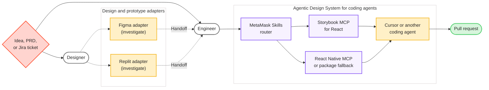
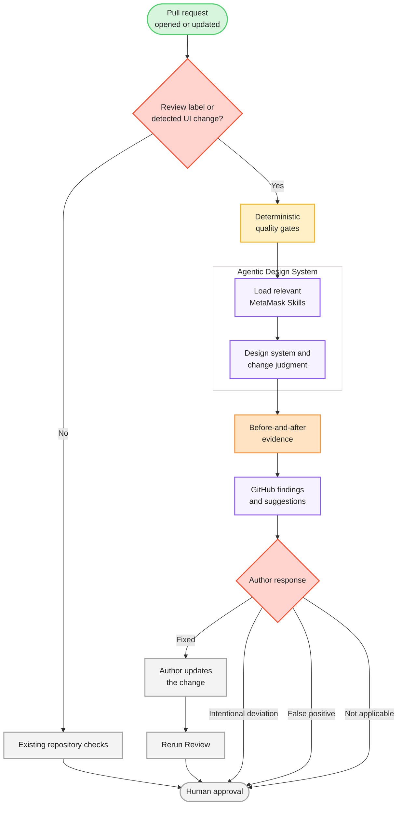
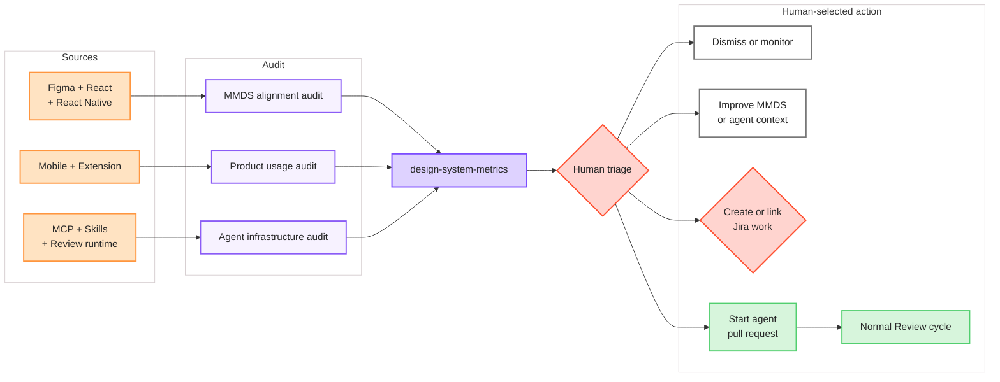
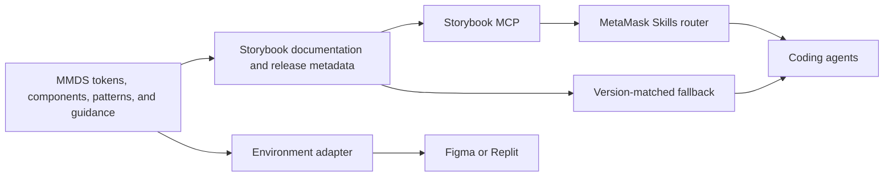

# MetaMask agentic design system strategy

**Status:** Draft

**Owner:** MetaMask Design System team

**Last updated:** 2026-08-28

## 1. Goal

UI created with agents should be MMDS-aligned by default, and every UI change should be checked before merge. Any deviation should be intentional, visible, and measurable.

This applies anywhere UI gets built: Cursor and other coding agents, Figma, Replit prototypes, and CI. Delivery will happen in stages because each environment has different capabilities.

This strategy asks the MMDS and partner teams to commit to this outcome, a phased plan, clear ownership, and enough capacity to deliver it. It does not define the technical design for every service.

The primary audience is the MMDS team. The strategy also directs work with AI Platform Engineering, QA, and contributors in the **ai-platform-eng** channel.

- **MMDS owns** design system knowledge, patterns, alignment, check quality, and Audit triage.
- **Partner teams own** shared Review and agent infrastructure.
- **Product teams own** product decisions and changes.

MMDS should make the available design system option clear. It should measure the outcome without acting as the design system police.

### Success measures

Success means supported agents can build with current MMDS knowledge and UI pull requests reach a recorded design system outcome. Product teams can still choose custom UI after the applicable MMDS option is clear.

The first pilots will establish baselines. Numeric targets will follow four weeks of stable data.

| Measure                        | What it tells us                                                                                                       | Initial target                                                                      |
| :----------------------------- | :--------------------------------------------------------------------------------------------------------------------- | :---------------------------------------------------------------------------------- |
| **MMDS assurance rate**        | Percentage of eligible UI pull requests that receive MMDS checks and reach a recorded outcome                          | Establish a labeled pilot baseline, then expand through automatic UI detection      |
| **Aligned merge rate**         | Percentage of checked UI pull requests that are MMDS-aligned at merge                                                  | Establish a baseline, then improve it each quarter                                  |
| **Intentional deviation rate** | Percentage of checked UI pull requests where the product team records a decision not to use the applicable MMDS option | Report separately from alignment so inconsistency remains visible                   |
| **Unresolved finding rate**    | Percentage of checked UI pull requests merged without resolving or responding to a finding                             | Reduce from the pilot baseline                                                      |
| **Review finding precision**   | How often an inferred finding is correct and useful                                                                    | Keep each inferred check advisory until it reaches 90% precision across 50 findings |
| **Knowledge freshness**        | Time between an MMDS release and current component facts reaching agents                                               | Same release, with no hand-written component lists                                  |
| **Platform alignment**         | Shared component inventory, shared core API coverage, platform exceptions, and Code Connect coverage                   | Establish the DSYS-302 baseline, then set targets                                   |
| **Product drift**              | Component usage, pattern use, custom UI, overrides, and recurring deviations                                           | Classify the pilot baseline before setting reduction targets                        |

### MMDS must align internally

Today, Figma, React, and React Native are not sufficiently aligned. React Native has moved ahead in some areas while React is missing components that should be shared. Figma improvements have not always reached both code platforms.

We need a shared component inventory across Figma, React, and React Native. Each component should be classified as:

- Required across all three platforms.
- Required only on named platforms.
- Missing an implementation.
- Covered by an intentional platform exception.
- Planned for removal.

Shared components should use the same name and core API. The shared core covers semantic variants, sizes, states, content options, behavior, and accessibility intent. A platform can add properties for a distinct platform need. Code Connect should map the shared contract where Figma supports it.

This work is tracked in [DSYS-302](https://consensyssoftware.atlassian.net/browse/DSYS-302).

### Now, next, later

| Horizon                         | Focus                                                    | What it includes                                                                                                                                                                                                                                                                                  | Outcome                                                                                              |
| :------------------------------ | :------------------------------------------------------- | :------------------------------------------------------------------------------------------------------------------------------------------------------------------------------------------------------------------------------------------------------------------------------------------------ | :--------------------------------------------------------------------------------------------------- |
| **Now — Establish and measure** | Run Knowledge, Assurance, and Harness tracks in parallel | Route React agents from MetaMask Skills to Storybook MCP; provide React Native MCP or a version-matched package fallback; improve docs and patterns; build the shared inventory; pilot labeled Review; evaluate the Review runtime; extend Audit metrics; test Figma and Replit with shared tasks | Current MMDS context for coding agents, clear baselines, and decisions for unresolved delivery paths |
| **Next — Operationalize**       | Make Create, Review, and Audit part of normal delivery   | Detect UI changes automatically; run trusted MMDS Review through the selected runtime; improve checks from feedback; run recurring audits; deliver approved Figma and Replit adapters; route confirmed work through normal planning                                                               | UI creation and review use the same knowledge while humans keep control of product decisions         |
| **Later — Improve and repair**  | Help teams act on trusted findings                       | Let a human select a finding, create or link Jira work, and start an agent that opens a small pull request; include visual evidence; send every pull request through normal Review                                                                                                                | The system helps teams correct drift without creating an automatic product-work backlog              |

---

## 2. What is an agentic design system?

An agentic design system is MMDS knowledge, delivery paths, checks, and audits that help agents create MMDS-aligned UI by default.

For MetaMask:

> Any supported agent creating UI can reach current MMDS tokens, components, and patterns. Work can then be checked against the same knowledge.

One knowledge layer supports three lifecycle moments:

- At **Create**, agents read MMDS context before building.
- At **Review**, deterministic and inferred checks assess a pull request.
- At **Audit**, recurring scans find alignment gaps, product drift, and delivery problems.

Tools are delivery mechanisms. Component facts should not be copied into every skill or template. That copy becomes stale after releases.

## 3. Why now

An engineer, designer, or agent can now build UI in hours. Speed without encoded quality creates drift at scale.

Some MMDS knowledge is explicit: tokens, components, APIs, and lint rules. Some is emergent: patterns found in successful product work. Some still lives as undocumented judgment inside the design system team.

Agents cannot apply knowledge they cannot find. Review tools cannot check rules or patterns that have not been written down. Audit tools cannot reveal custom UI when they only count imports.

This strategy makes MMDS legible to agents and measurable across the product.

### Current gaps

| Gap                                                               | Effect                                                                  |
| :---------------------------------------------------------------- | :---------------------------------------------------------------------- |
| MetaMask Skills contains copied component information             | Skills become stale after MMDS releases                                 |
| Figma, React, and React Native are not fully aligned              | Designers and engineers see different available components and APIs     |
| Pattern and taste guidance is incomplete                          | Agents can find a component without knowing when to use it              |
| Figma and Replit lack a proven context path                       | Early designs and prototypes can begin outside MMDS                     |
| Existing pull request checks cover only a few deterministic rules | Component and pattern choices receive no automatic design system review |
| Existing metrics focus on migration counts                        | Custom UI, recurring deviations, and system gaps remain hard to see     |

## 4. Lifecycle

The agentic design system appears at three moments: Create, Review, and Audit.

```mermaid
flowchart LR
  subgraph CREATE["Create"]
    direction TB
    IDEA{"Idea, PRD,<br/>or Jira ticket"}
    PERSON(["Designer or engineer"])
    KNOWLEDGE["MMDS knowledge<br/>through skills, MCP, or adapters"]
    PR(["Pull request"])
    IDEA --> PERSON --> KNOWLEDGE --> PR
  end

  subgraph REVIEW["Review"]
    direction TB
    CHECKS["Deterministic gates<br/>and agentic Review"]
    OUTCOME{"Finding outcome<br/>recorded?"}
    APPROVAL(["Human approval"])
    CHECKS --> OUTCOME --> APPROVAL
  end

  PRODUCT["Mobile / Extension"]

  subgraph AUDIT["Audit & Metrics"]
    direction TB
    AUDITS["Alignment, product usage,<br/>and infrastructure audits"]
    METRICS["design-system-metrics"]
    TRIAGE{"Human triage"}
    BACK["Confirmed work<br/>returns to Create"]
    AUDITS --> METRICS --> TRIAGE --> BACK
  end

  PR --> CHECKS
  APPROVAL --> PRODUCT --> AUDITS

  classDef idea fill:#ffd4cf,stroke:#ff4f30,stroke-width:2px,color:#272727
  classDef person fill:#ffffff,stroke:#777777,stroke-width:2px,color:#272727
  classDef system fill:#f7f2ff,stroke:#8b5cf6,stroke-width:2px,color:#272727
  classDef pr fill:#d7f5dc,stroke:#52cf6f,stroke-width:2px,color:#272727
  classDef product fill:#ffe3c2,stroke:#ff963f,stroke-width:2px,color:#272727
  classDef metrics fill:#ded2ff,stroke:#7c4dff,stroke-width:2px,color:#272727

  class IDEA,OUTCOME,TRIAGE idea
  class PERSON,APPROVAL person
  class KNOWLEDGE,CHECKS,AUDITS,BACK system
  class PR pr
  class PRODUCT product
  class METRICS metrics

  style CREATE fill:#ffffff,stroke:#d6ced0
  style REVIEW fill:#ffffff,stroke:#d6ced0
  style AUDIT fill:#ffffff,stroke:#d6ced0
```

Source: [MMDS Agentic Strategy FigJam](https://www.figma.com/board/3ijfD8P0KHe1M5ubwhk27k/MMDS-Agentic-Strategy)

### Create

Create begins with an idea, design, prototype, or ticket. It ends with a pull request.

The first supported path is an engineer using Cursor or another coding agent:

1. MetaMask Skills recognizes a UI task.
2. The UI skill routes the agent to current MMDS knowledge.
3. React agents query Storybook MCP.
4. React Native agents query equivalent MCP access or inspect version-matched package metadata.
5. The agent uses documented tokens, components, APIs, and patterns.
6. The engineer opens a pull request.

The React Native fallback may use exports, types, and generated metadata from the installed package in `node_modules`. The skill can contain stable discovery instructions. It must not contain a copied component inventory.

Figma and Replit remain part of the strategy. During Now, we will test which agentic harnesses they provide and how each can receive the same knowledge. A generated adapter may be needed when direct MCP access is not available.

All Create paths should provide:

- Current MMDS context when a decision is made.
- A clear handoff between tools.
- A way to surface missing MMDS guidance.
- The same Review checks when work reaches a pull request.

### Review

Review applies MMDS checks to a pull request before human approval.

The pilot starts on pull requests with a design system Review label. Once the findings are accurate enough to trust, UI detection should apply Review automatically across Mobile and Extension.

The Review runtime must:

- Run existing deterministic quality gates.
- Load the relevant MetaMask Skills.
- Require the design system skill for UI changes.
- Query current MMDS sources.
- Collect before-and-after evidence when UI is renderable.
- Post GitHub comments or suggestions.
- Record the response to each inferred finding.
- Rerun after changes.

Risk Analyzer is the first runtime to test because QA already operates it. If it cannot meet this contract, Agent Orchestration or another service should be tested against the same contract. MMDS owns the contract and the design system knowledge. The partner team owns the runtime.

Each inferred finding supports four responses:

- **Fixed**
- **Intentional deviation**
- **False positive**
- **Not applicable**

False positives feed back into patterns, documentation, or Review context. A code annotation is optional when a long-lived deviation needs context for future audits.

Deterministic checks may block from the start. Inferred checks begin as advisory. Each inferred check must reach at least 90% precision across 50 findings before it can block. Where possible, a trusted inferred check should become a deterministic rule and be tested against historical changes.

A human still approves and merges every pull request. Reliable MMDS assurance is one requirement for future low-risk auto-approval, but this strategy does not authorize automatic approval or merge. A related draft, [UX papercut auto-approval pilot](./ux-papercut-auto-approval-pilot.md), explores a fail-closed path where a trusted GitHub App may submit the required approval for narrowly scoped presentation-only changes after shadow calibration. In that pilot a human still merges, including by enabling GitHub Auto-merge.

### Audit

Audit begins during Now. It provides the baseline for alignment, product usage, and agent delivery.

It has three scopes:

1. **MMDS alignment audit:** measures the shared component inventory across Figma, React, and React Native.
2. **Product usage audit:** measures MMDS usage, custom UI, overrides, composition, and pattern use across Mobile and Extension.
3. **Agent infrastructure audit:** measures knowledge freshness, MCP reachability, Review coverage, and finding quality.

Audit classifies findings as:

- **Accidental drift:** MMDS should have been used.
- **Intentional one-off:** A valid product choice with limited reuse.
- **System gap:** A repeated product need that MMDS does not yet support well.
- **Platform exception:** A valid difference between Figma, React, and React Native.
- **Legacy migration:** Older UI that predates current MMDS guidance.

Audit findings appear in the [design-system-metrics](https://github.com/MetaMask/design-system-metrics) development app first. The existing app already tracks Mobile and Extension migration over time. It can be changed quickly as the new Audit model develops.

A person decides whether to:

- Dismiss an inaccurate finding.
- Continue monitoring it.
- Classify it as a system gap.
- Ask a product team for context.
- Create or link a Jira issue.
- Start an agent remediation task.

Audit does not create or route product work automatically.

## 5. How knowledge reaches agents

### The gateway model

MetaMask Skills currently contains a hand-written component list. A hand-written list becomes wrong after releases.

The UI skill should become a thin router. It tells the agent where to find current MMDS facts and supplies stable guidance about how to use them.

For coding agents, Storybook MCP is the preferred delivery method. It serves structured documentation maintained beside MMDS code. It is a delivery choice, not the strategy itself.

Fallbacks should be used in this order:

1. Read version-matched exports, types, and metadata from the installed package.
2. Generate a structured component and guidance index during the MMDS release.
3. Host a dedicated MMDS MCP server if Storybook MCP cannot meet the need.

Figma and Replit may need their own adapters. Those adapters should use the same MMDS sources and should not become new knowledge stores.

### Pattern governance

The MMDS team owns patterns and keeps them current.

1. Product work or Audit identifies a repeated need.
2. MMDS validates whether it is a one-off or a system gap.
3. Design and engineering agree on intent, variations, and platform needs.
4. The pattern is documented with examples and guidance.
5. The release makes the pattern available to agents.
6. Review checks new work against the pattern.
7. Audit measures pattern use and recurring deviations.
8. Findings improve the pattern.

Pattern changes require human approval because they encode product judgment.

## 6. Checks and evidence

Existing build, test, accessibility, security, and organization-level checks remain under their current owners. This strategy adds design system checks.

| Gate                              | Type                                           | Initial enforcement                                 |
| :-------------------------------- | :--------------------------------------------- | :-------------------------------------------------- |
| Invalid or arbitrary token usage  | Deterministic                                  | Blocking                                            |
| Deprecated component or API usage | Deterministic                                  | Blocking                                            |
| Custom UI                         | Deterministic detection plus inferred judgment | Advisory                                            |
| Component choice                  | Inferred                                       | Advisory                                            |
| Pattern choice                    | Inferred                                       | Advisory                                            |
| Visual regression                 | Visual comparison plus judgment                | Evidence required when available; advisory at first |
| MetaMask taste and quality        | Inferred                                       | Advisory                                            |

Before-and-after images should accompany renderable UI changes. They help reviewers see the result and create evidence for future trust decisions.

Changed lines alone should not define a low-risk change. A future benchmark should use historical pull requests with:

- One clear visual outcome on a small surface.
- No state, security, transaction, or navigation changes.
- Passing deterministic checks.
- Clear before-and-after evidence.
- No unresolved custom UI finding.
- A simple rollback path.

## 7. Delivery plan

Now runs three tracks in parallel. The strategy remains phase-based. Jira epics and delivery plans should assign individuals and dates once partner capacity is confirmed.

### Track 1: Knowledge

| Deliverable                                                    | Outcome                                                      | Owner                             |
| :------------------------------------------------------------- | :----------------------------------------------------------- | :-------------------------------- |
| Route React agents from MetaMask Skills to Storybook MCP       | React agents query current MMDS knowledge by default         | MMDS with MetaMask Skills support |
| Provide React Native MCP or a version-matched package fallback | The React Native skill does not become stale                 | MMDS with Context Forge support   |
| Build the shared component inventory                           | Figma, React, and React Native gaps become explicit          | MMDS, tracked in DSYS-302         |
| Expand Code Connect                                            | Shared components map between Figma and code where supported | MMDS                              |
| Improve component, pattern, and taste documentation            | Agents receive why and when, not only props                  | MMDS                              |

### Track 2: Assurance

| Deliverable                                        | Outcome                                                    | Owner                       |
| :------------------------------------------------- | :--------------------------------------------------------- | :-------------------------- |
| Run a labeled Review pilot in Mobile and Extension | Review quality can improve without noisy automatic rollout | MMDS with QA or AI Platform |
| Test Risk Analyzer against the Review contract     | The preferred runtime receives a fair capability test      | QA with MMDS                |
| Test Agent Orchestration if needed                 | Review has a defined fallback path                         | AI Platform with MMDS       |
| Build UI-change detection after the pilot          | Trusted Review expands without depending on author tooling | MMDS with runtime owners    |
| Extend the metrics app for Review and Audit        | Findings, responses, alignment, and drift become visible   | MMDS                        |
| Run the first alignment and product audits         | The strategy has a measurable baseline                     | MMDS                        |

### Track 3: Harnesses

Figma and Replit should run the same small set of golden tasks. Each environment should be able to:

- Find the right MMDS component.
- Retrieve current guidance.
- Apply a documented pattern.
- Avoid a known deprecated component.
- Explain which source it used.
- Produce an output that can enter Review or Audit.

Each investigation must record supported access paths, gaps, a recommended adapter, evidence, an estimate, and a go, defer, or stop decision.

### Now exit gate

Now is complete when:

- React agents reach Storybook MCP through MetaMask Skills by default.
- React Native agents use MCP or a version-matched fallback.
- No supported skill contains a hand-maintained component inventory.
- The first shared component inventory and alignment baseline exist.
- The labeled Review pilot meets the agreed finding-quality threshold.
- Risk Analyzer or another Review path is selected.
- The metrics app shows the first Review and Audit baselines.
- Figma and Replit investigations produce decisions.

### Dependencies

| Need                    | MMDS responsibility                                 | Partner responsibility                                |
| :---------------------- | :-------------------------------------------------- | :---------------------------------------------------- |
| Knowledge and authoring | Components, patterns, taste, inventory, and quality | Protected team capacity                               |
| Storybook MCP           | Documentation and release metadata                  | Context Forge reachability and consumer configuration |
| Review runtime          | Capability contract, checks, and evaluation         | Runtime, GitHub integration, and reruns               |
| Visual evidence         | Evidence requirements and examples                  | Reliable collection in Mobile and Extension           |
| Product scans           | Classification and metrics                          | Repository access and ownership data                  |
| Figma and Replit        | Golden tasks and quality evaluation                 | Harness access and supported integration paths        |

## 8. Audit and measurement

The [design-system-metrics](https://github.com/MetaMask/design-system-metrics) app becomes the operating view for Audit and Review outcomes.

Use separate units for separate questions:

| Scope                | Unit                                       | Question                                                                     |
| :------------------- | :----------------------------------------- | :--------------------------------------------------------------------------- |
| Component alignment  | Shared component inventory item            | Does the component exist with a shared core API on each applicable platform? |
| Component adoption   | Component usage in product code            | Where do products use MMDS, legacy components, or custom UI?                 |
| Pattern adoption     | Named screen, modal, surface, or user flow | Where is a documented pattern used or missing?                               |
| Review coverage      | Eligible UI pull request                   | Which UI changes received MMDS checks and recorded an outcome?               |
| Agent infrastructure | Delivery or Review run                     | Did the agent receive current knowledge and produce useful results?          |

Metrics should run on this cadence:

- Collect and publish data weekly.
- Review findings and system gaps monthly.
- Review strategy outcomes quarterly.
- Use the first four stable weeks as the baseline.
- Set numeric targets after the baseline.

The product team owns changes in its repository. MMDS supplies guidance, codemods, agent workflows, and example pull requests. MMDS may lead high-value migrations as examples, but it should not become the default migration workforce.

### Human-controlled remediation

An agent can help after a person confirms an Audit finding:

1. A person selects the finding.
2. A Jira issue is created or linked.
3. The agent receives the issue, finding evidence, and current MMDS context.
4. The agent opens a small pull request.
5. The pull request enters the same Review cycle.
6. The product team approves and merges.

## 9. Decision gates and investigations

These investigations inform delivery. They do not change the strategy.

### Review runtime

Test Risk Analyzer first. The test must confirm that it can:

- Run on a labeled pull request.
- Load relevant MetaMask Skills.
- Query current MMDS sources.
- Post findings and suggestions.
- Record finding responses.
- Rerun after changes.
- Supply data to the metrics app.

If it cannot meet the contract, test Agent Orchestration or another service against the same contract.

### React Native delivery

Confirm:

- Whether Storybook React Native can expose the required MCP data.
- Whether Context Forge can host or broker it.
- Whether a React Native Web Storybook serves the full manifest.
- Which version-matched package metadata is required as the fallback.

### Figma and Replit

Find the agentic harnesses available in each environment. Run the shared golden tasks and decide whether each environment can use MCP directly, needs an adapter, or should be deferred.

### UI detection and visual evidence

Confirm:

- Which paths, file types, and semantic signals identify UI changes.
- How uncertain changes are classified.
- Which Mobile and Extension tooling can collect reliable before-and-after images.
- How missed UI changes and false positives improve detection.

### Alignment Audit

Test whether an MMDS Audit skill can compare:

- The shared component inventory.
- Figma component names and properties.
- React and React Native exports and shared APIs.
- Code Connect mappings.
- Documented platform exceptions.

## 10. Boundaries

- Product teams can choose intentional deviations.
- MMDS does not approve every product decision.
- Audit findings do not create or route work automatically.
- Agents do not merge product changes.
- Judgment-based checks remain advisory until they meet the trust threshold.
- Reliable MMDS assurance can support future organization-level auto-approval, but it is not sufficient on its own.
- See [UX papercut auto-approval pilot](./ux-papercut-auto-approval-pilot.md) for a proposed fail-closed approval pilot that keeps human merge (and allows GitHub Auto-merge as human merge intent).

## 11. Appendix

- [UX papercut auto-approval pilot](./ux-papercut-auto-approval-pilot.md)
- [MMDS Agentic Strategy FigJam](https://www.figma.com/board/3ijfD8P0KHe1M5ubwhk27k/MMDS-Agentic-Strategy)
- [Patterns FigJam](https://www.figma.com/board/CDy0suxFcEjMu68vaGjiKQ/Patterns)
- [Into Design Systems — Agentic Design Systems](https://www.intodesignsystems.com/agentic-design-systems)
- [Storybook MCP overview](https://storybook.js.org/docs/ai/mcp/overview)
- [Shared component inventory and alignment epic (DSYS-302)](https://consensyssoftware.atlassian.net/browse/DSYS-302)
- [AI Platform Engineering discussion about the post-Bugbot Review gap](https://consensys.slack.com/archives/C0ALR2ATTJT/p1787859259423249)
