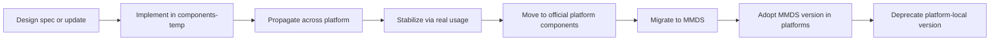

# Design System Component Development and Migration Process

<!-- The status should be set to one of these values: -->
<!-- Proposed | Rejected | Accepted | Deprecated | … | Superseded by [alternative](./alternative.md) -->

Status: Proposed

Deciders: Design System Team, Platform Engineering (metamask-mobile, metamask-extension)

## Problem Statement

The current component development and migration process leads to fragmentation, duplication, and slow convergence toward a unified design system.

### 1. Migration Responsibility Clashes

Component migrations often have dependency chains (e.g., Component A depends on Component B). This results in multiple engineers unknowingly working on the same components, blocked migrations due to missing upstream components, lack of ownership clarity, and reduced productivity.

### 2. Insufficient Design Support Integration

Design is actively evolving and frequently introducing new components or updates to existing ones. The current model has feature engineers implementing new components ad hoc; implementations are often siloed and feature-specific; multiple versions of the same component may be created; and components may not align with design system standards. Examples of ongoing misalignment include **ButtonFilter** (design aligned, not componentized), **TextField / TextFieldSearch** (componentized but not updated in MMDS), **Tooltip**, and **Footers**. This results in duplicate implementations across platforms, increased cost of later alignment, lack of a clear source of truth, and design inconsistencies across the product.

### 3. Lack of Component Propagation

Even when components exist in MMDS, there is no systematic process to adopt them across platforms. Platform codebases continue using legacy implementations, MMDS components remain underutilized, migration progress stalls, and the component library fails to deliver intended value.

### 4. Slow Feedback Loop for Component Development

Creating components directly in MMDS introduces friction (versioning and release processes for every update, expensive minor adjustments, harder iteration based on real usage). Creating components in platform `components-temp` directories allows rapid iteration and immediate feedback but lacks a clear path to formal adoption.

## Background

MetaMask currently maintains design system components across multiple codebases: **metamask-mobile** (React Native), **metamask-extension** (React), and the **MetaMask Design System monorepo (MMDS)** (React + React Native). There is an ongoing initiative to migrate platform-specific components into MMDS to establish a single source of truth. Additionally, each platform maintains a `components-temp` directory to house experimental or feature-specific components prior to formal design system adoption. While this approach enables rapid feature development, it has introduced the architectural and organizational challenges described above.

## Considered Options

- **Status quo** — Continue ad hoc implementation and migration without a defined process
- **Direct MMDS development** — Create and iterate on all new components only in MMDS
- **Two-phase component lifecycle with explicit role separation** — Design Support Engineer (platform) and Migration Engineer (MMDS) with a defined path from `components-temp` to MMDS

## Decision Outcome

Chosen option: **Two-phase component lifecycle with explicit role separation**

We will adopt a two-phase component lifecycle model with explicit role separation so that design support can happen on-platform with fast iteration and real usage, while migration into MMDS remains a distinct responsibility with clear ownership. This balances rapid design support, propagation across the platform, and a reliable path to a single source of truth in MMDS.

## Pros and Cons of the Options

### Status quo

Continuing with the current ad hoc implementation and migration approach.

- **Good, because**:
  - No process change or coordination overhead.
  - Teams can continue current workflows in the short term.
- **Neutral, because**:
  - Existing `components-temp` usage remains available for experimentation.
- **Bad, because**:
  - Migration responsibility clashes and duplicate work continue.
  - Design support remains siloed; alignment and propagation do not improve.
  - MMDS adoption and convergence toward a single source of truth remain slow.

### Direct MMDS development

Creating and iterating on all new components only in MMDS.

- **Good, because**:
  - Single place for component source of truth from the start.
  - No platform-specific drift by design.
- **Neutral, because**:
  - Aligns with long-term goal of a shared component library.
- **Bad, because**:
  - Versioning and release process for every update create friction.
  - Minor adjustments become expensive; iteration based on real usage is harder.
  - Slower stabilization and delayed availability to feature teams.

### Two-phase component lifecycle with explicit role separation

Design Support Engineer (platform integration) and Migration Engineer (MMDS integration) with a defined lifecycle from `components-temp` to official platform components to MMDS.

- **Good, because**:
  - Clear ownership: design support on platform, migration into MMDS.
  - Fast iteration in `components-temp` with real usage before migration.
  - Explicit path from experimentation to platform adoption to MMDS.
  - Reduces duplicate work and blocked migrations through defined roles and lifecycle.
- **Neutral, because**:
  - Requires coordination between Design Support and Migration roles.
  - Two phases add process steps compared to ad hoc or MMDS-only approaches.
- **Bad, because**:
  - Depends on resourcing and commitment for both roles.
  - Handoff from platform to MMDS can introduce delay if not prioritized.

## More Information

### Role A — Design Support Engineer (Platform Integration)

Responsible for: supporting ongoing design needs; creating new components in platform `components-temp`; ensuring implementations follow design system best practices; making components available to feature engineers early; propagating usage across the platform; stabilizing components through real-world usage; moving stabilized components to official platform component directories; updating platform code to use MMDS components after migration; deprecating platform-local implementations.

### Role B — Migration Engineer (MMDS Integration)

Responsible for: migrating stabilized platform components into MMDS; refactoring to align with cross-platform architecture; ensuring consistency with design tokens and patterns; preparing components for reuse across platforms; maintaining MMDS integrity.

### Proposed Component Lifecycle

1. **Design creates or updates component specifications**
2. **Design Support Engineer implements component in platform `components-temp`**
   - Aligns with design system best practices
   - Enables rapid iteration
   - Used by feature teams
3. **Component propagation across platform**
   - Replace ad hoc implementations
   - Gather feedback
   - Stabilize API and behavior
4. **Move component to official platform component directory**
   - Signals readiness for migration
5. **Migration Engineer ports component to MMDS**
   - Generalizes implementation
   - Ensures cross-platform compatibility
   - Integrates into design system architecture
6. **Design Support Engineer updates platforms to consume MMDS version**
   - Replace local implementations
   - Deprecate platform components

### Workflow Diagram

### References

- [Shared UI Component Library (0001)](./0001-shared-ui-component-library.md)
- [Style Architecture in Extension (0002)](./0002-style-architecture.md)

---

**Note:** This ADR is a proposal and is subject to further review and approval by the Deciders team. Feedback and suggestions are welcome to refine the process.
