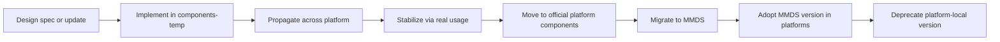

# Design System Component Development and Migration Process

**Status:** Active  
**Owners:** Design System Team, Platform Engineering (`metamask-mobile`, `metamask-extension`)

## Responsibilities

### Role A — Design Support Engineer (Platform Integration)

Responsible for:

- Supporting ongoing design delivery needs on platform teams
- Implementing new and updated components in platform `components-temp`
- Ensuring component implementations follow design system best practices
- Enabling early feature-team usage for real-world validation
- Propagating component usage across platform codebases
- Stabilizing API and behavior through usage feedback
- Moving stabilized components from `components-temp` to official platform component directories
- Updating platform code to consume MMDS components after migration
- Deprecating and removing platform-local implementations when MMDS replacements are adopted

### Role B — Migration Engineer (MMDS Integration)

Responsible for:

- Migrating stabilized platform components into MMDS
- Refactoring implementations for cross-platform architecture alignment
- Ensuring use of shared design tokens and MMDS patterns
- Preparing components for reuse across React and React Native packages
- Maintaining MMDS consistency, quality, and long-term integrity

## Process

### Standard Component Lifecycle

1. **Design creates or updates component specifications**
2. **Design Support Engineer implements in platform `components-temp`**
   - Align with design system best practices
   - Enable fast iteration and early feature usage
3. **Design Support Engineer propagates across the platform**
   - Replace ad hoc implementations
   - Gather feedback from real usage
   - Stabilize API and behavior
4. **Design Support Engineer moves component to official platform directory**
   - Marks platform readiness for MMDS migration
5. **Migration Engineer migrates component to MMDS**
   - Generalize implementation
   - Ensure cross-platform compatibility
   - Integrate with MMDS architecture
6. **Design Support Engineer adopts MMDS component in platform repos**
   - Replace platform-local component usage
   - Deprecate and remove platform-local versions

### Workflow Diagram

```mermaid
flowchart LR
Design[Design spec or update] --> Temp[Implement in components-temp]
Temp --> Propagate[Propagate across platform]
Propagate --> Stabilize[Stabilize via real usage]
Stabilize --> Official[Move to official platform components]
Official --> Migrate[Migrate to MMDS]
Migrate --> Adopt[Adopt MMDS version in platforms]
Adopt --> Deprecate[Deprecate platform-local version]
```
