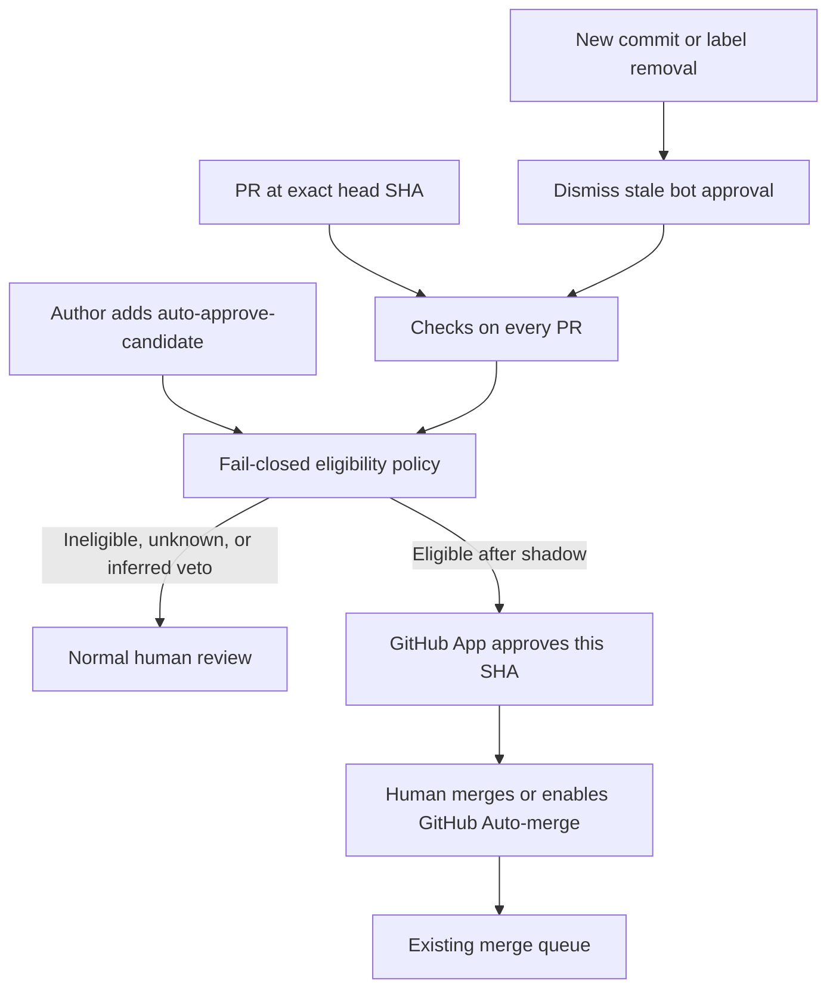
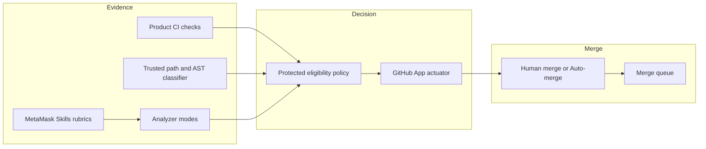

# UX papercut auto-approval pilot

**Status:** Draft proposal

**Owner:** MetaMask Design System team (proposal), with AI Platform Engineering, QA, and product engineering partners

**Related:** [Agentic design system strategy](./agentic-design-system-strategy.md)

**Last updated:** 2026-09-02

## 1. Why this exists

Leadership wants a path to auto-merged PRs. UX papercuts were suggested as a starting place because many of them look low consequence.

That intuition is useful as a **program**, not as a machine-readable safety definition. Some papercuts touch navigation, confirmations, permissions, analytics, localization, or shared primitives. A label that says “papercut” must never be treated as proof that a change is safe.

This proposal defines a fail-closed pilot where:

- evidence-producing checks run on **all** pull requests;
- authors may **nominate** a PR for automated approval;
- a trusted GitHub App may submit the **one required approval** only after historical replay and shadow calibration;
- a **human still merges** (including by enabling GitHub Auto-merge).

The [agentic design system strategy](./agentic-design-system-strategy.md) already states that reliable MMDS assurance can support future organization-level auto-approval, but is not sufficient on its own, and that agents do not merge product changes. This pilot stays inside those boundaries.

## 2. Authority model

| Actor                                    | May do                                                                       | Must not do                                      |
| :--------------------------------------- | :--------------------------------------------------------------------------- | :----------------------------------------------- |
| Author (internal, with label permission) | Add `auto-approve-candidate` to request evaluation                           | Prove safety by labeling                         |
| Product CI                               | Produce check results and artifacts at the head SHA                          | Approve or merge                                 |
| Trusted eligibility classifier           | Deterministically classify allowed changed nodes/paths from protected policy | Use LLM judgment as a grant                      |
| AI analyzer modes                        | Produce risk / UX / MMDS evidence and vetoes                                 | Submit `APPROVE`                                 |
| MetaMask Skills                          | Provide review rubrics and knowledge routing                                 | Own gate thresholds or CI allowlists             |
| GitHub App (existing or purpose-built)   | Independently re-fetch evidence and approve or dismiss for that SHA          | Call the merge API                               |
| Human engineer                           | Merge, or enable GitHub Auto-merge after approval                            | Be removed from the merge decision in this pilot |
| Merge queue                              | Enforce mergeability after human merge intent                                | Decide eligibility                               |

### Human merge and GitHub Auto-merge

In the first live phase the App only supplies the required approval. A person still has to merge.

Enabling GitHub **Auto-merge** on an eligible PR is allowed. That is a human merge decision. The existing merge queue still runs. System-initiated merge with no human merge action remains a later organization decision, not part of this pilot.

### Nomination vs taxonomy

- `auto-approve-candidate` — request for automated approval evaluation. Required for live approval. Never treated as evidence.
- `ux-papercut` (optional) — product taxonomy only. Not sufficient for approval.

## 3. Safety principles

1. **Deterministic checks establish eligibility.** Inferred checks (risk, MMDS constraints, visual, taste) may veto automation. They cannot grant it.
2. **Fail closed.** Missing, skipped, `neutral`, stale, timed-out, or unavailable evidence routes to human review.
3. **Bind every decision to the exact head SHA.** New commits dismiss stale bot approval. Org rules already dismiss stale reviews and require last-push approval.
4. **Least-privilege approval identity.** Do not enable general `GITHUB_TOKEN` PR approval for the repository. Prefer an existing MetaMask GitHub App if it matches a review-only profile; otherwise create a purpose-built App. No visible MetaMask product workflow currently submits `APPROVE` reviews.
5. **Candidates must not evaluate themselves.** Do not load approval policy from the PR head’s `.ai-pr-analyzer` or `.github` trees. Changes to those paths, workflows, analyzer pins, or the policy store disqualify the PR.
6. **Blocking and bypass labels disqualify.** Examples: `need-ux-ds-review`, `needs-qa`, `blocked`, `DO-NOT-MERGE`, `skip-e2e`, and equivalent Extension labels.
7. **Asymmetric AI authority.** AI may veto automation. AI “looks safe” must never override a failed or unknown deterministic criterion.

## 4. First live change envelope

**Presentation-only** changes on MetaMask Mobile and MetaMask Extension.

### Allowed

- Existing design-token or Tailwind class substitutions.
- Layout and spacing changes using existing MMDS primitives.
- Allowlisted visual props on existing components (documented color, size, variant props).
- Test, story, or snapshot updates that only support the visual delta.

### Copy

- **Shadow first.** Collect decisions without approving.
- Then allow only allowlisted non-sensitive surfaces.
- Exclude auth, recovery phrase, confirmations, transactions, permissions, legal, and security warning copy from the first live envelope.

### Always excluded

- New functions, handlers, hooks, conditionals, loops, or side-effectful imports.
- Navigation, state/store, network, storage, analytics, permissions, transactions, signing, account or key management.
- New components or shared primitive package changes.
- Dependencies, lockfiles, generated artifacts, workflows, config, native code, build scripts.
- Deleted or weakened tests, blanket snapshot regeneration, lint suppressions, coverage exemptions.
- Fork PRs, drafts, conflicted PRs, and PRs not targeting the default integration branch.

Line count may be used as a **pilot scope cap**. It is not a safety proof. Classification must use AST / changed-node allowlists, not a “JSX and no functions” regex. JSX can still introduce handlers, conditionals, navigation, and unsafe links without a new function declaration.

## 5. Criteria model

Every criterion returns one of:

- **pass** — evidence present and satisfied for this SHA
- **fail** — evidence present and disqualifying
- **unknown** — evidence missing, stale, skipped, or unreadable → treat as human review

### Deterministic (must all pass)

| Criterion                                            | Notes                                                                           |
| :--------------------------------------------------- | :------------------------------------------------------------------------------ |
| Nomination label present                             | `auto-approve-candidate` at evaluation time                                     |
| Internal non-fork, non-draft, default base branch    | Exact head SHA                                                                  |
| Required CI allowlist green                          | Explicit job names; skipped / neutral / missing fail closed                     |
| Path and changed-node allowlist                      | Presentation-only envelope                                                      |
| No dependency or lockfile changes                    |                                                                                 |
| No workflow, analyzer config, or policy-path changes | Self-evaluation prevention                                                      |
| No blocking or bypass labels                         |                                                                                 |
| Review threads and Bugbot findings clear             | Open, unresolved, or post-decision findings fail or re-evaluate                 |
| Before/after evidence present                        | Platform-appropriate; author evidence is a claim until automated capture exists |

### Inferred (veto only until calibrated)

| Check                    | Role in pilot                                            |
| :----------------------- | :------------------------------------------------------- |
| PR risk analysis         | Veto on elevated risk / not merge-safe                   |
| MMDS constraint review   | Veto on clear MMDS policy violations visible in the diff |
| Visual / papercut review | Veto or advisory until precision is measured             |
| Design taste             | Advisory only until calibrated                           |

MMDS review in current analyzer CI remains **constraint-level**: MMDS by default, Tailwind over new SCSS where Extension policy requires it, no new raw primitives where policy forbids them, no arbitrary colors. It does **not** yet have Storybook MCP or consumer `node_modules` design-system packages in the analyzer job. In-depth API and pattern review against Storybook docs is out of scope until a version-matched knowledge path exists.

Finding-level trust targets from the agentic strategy (for example 90% precision across 50 findings) apply to **individual inferred checks**. The approval decision itself requires **zero known unsafe eligible decisions** before live approval.

## 6. Architecture

| Layer              | Owns                                                              | Does not own                  |
| :----------------- | :---------------------------------------------------------------- | :---------------------------- |
| Product CI         | Required check allowlist at SHA, artifacts                        | Approval                      |
| Trusted classifier | Path/node eligibility from protected policy                       | LLM judgment                  |
| Analyzer modes     | `pr-risk-analysis` plus proposed `ux-papercut-review` as evidence | `APPROVE`                     |
| MetaMask Skills    | Thin review rubric; load UI, visual, and taste skills             | Gate thresholds, CI job lists |
| GitHub App         | Independent re-fetch, approve, dismiss                            | Merge                         |
| Merge queue        | Mergeability after human merge intent                             | Eligibility                   |

### Analyzer and platform gaps to call out

These are known gaps for partners, not work this markdown implements:

- Consumer analyzer config and custom modes can load from the PR checkout today. Approval policy must come from a trusted source (release, base branch, or central store).
- Current risk-gate `neutral` conclusions must not be reused as an approval pass.
- PR metadata helpers exist but are not fully wired into analysis context.
- PR comment tools lack reliable review-thread resolution state.
- No structured check-run allowlist tool is available to the analyzer agent.
- Storybook MCP and installed design-system package types are not available in current analyzer workflows.

### Skills shape

If a MetaMask skill is added for this program, keep it thin:

- investigate nominated UX papercuts;
- load current MMDS / UI gateway guidance;
- inspect before/after evidence;
- report concerns, uncertainty, and missing evidence.

It must not contain static component inventories, CI job lists, approval thresholds, or authority to approve.

## 7. Historical benchmark (required before implementation)

Before building actuators, curate at least **50 pull requests per product** (Mobile and Extension):

- clear presentation-only papercuts;
- risky lookalikes;
- sensitive copy;
- shared-component diffs;
- missing or stale evidence;
- skipped CI and bypass labels;
- findings posted after first evaluation.

Humans label expected eligibility **before** the policy runs. Implementation starts only after replay results are reviewed.

## 8. Rollout

1. **Historical replay** against the curated set.
2. **Observe** all PRs with no nomination required; report would/would-not approve.
3. **Nominated shadow** decisions when authors add `auto-approve-candidate`.
4. **Human confusion-matrix review**, especially eligible-but-unsafe misses.
5. **Live App approval** with random human audit and a kill switch.
6. **Expand one capability at a time** (for example allowlisted copy).
7. **System auto-merge** remains a separate later decision.

### Success bar for live approval

- Zero known unsafe eligible decisions on the historical set and shadow sample.
- Kill switch documented and tested.
- Audit record for every criterion, source, timestamp, SHA, and decision.

## 9. Governance

| Partner               | Responsibility                                  |
| :-------------------- | :---------------------------------------------- |
| Product engineering   | Approval policy and accepted risk               |
| AI Platform / QA      | Analyzer runtime and evidence quality           |
| MMDS                  | MMDS constraint-check quality and skill routing |
| GitHub administrators | App inventory, permissions, repository controls |

### Open decisions before build

1. Does an existing MetaMask GitHub App meet the least-privilege review profile, or is a purpose-built App required?
2. Where does trusted policy live (analyzer release, protected default-branch config, or central store)?
3. What is the explicit required-check allowlist per repository? Branch rules today do not encode “all CI green.”
4. What visual evidence path is mandatory for Mobile vs Extension in the first live envelope?
5. Who signs off the move from shadow to live approval?
6. Who owns the historical benchmark curation?

## 10. Out of scope

- Implementing analyzer modes, GitHub App workflows, or skills PRs in this document.
- System-initiated merge without human merge intent.
- Using Storybook MCP or consumer `node_modules` as Review knowledge until those paths exist in the runtime.
- Treating `ux-papercut` or line count as sufficient safety evidence.

## 11. Recommended next steps

1. Socialize this proposal with AI Platform Engineering, QA, Mobile, and Extension partners.
2. Inventory existing GitHub Apps against the approval permission profile.
3. Start the historical benchmark checklist for both products.
4. After partner agreement, open implementation work in the analyzer, product workflows, and MetaMask Skills as separate deliverables.
